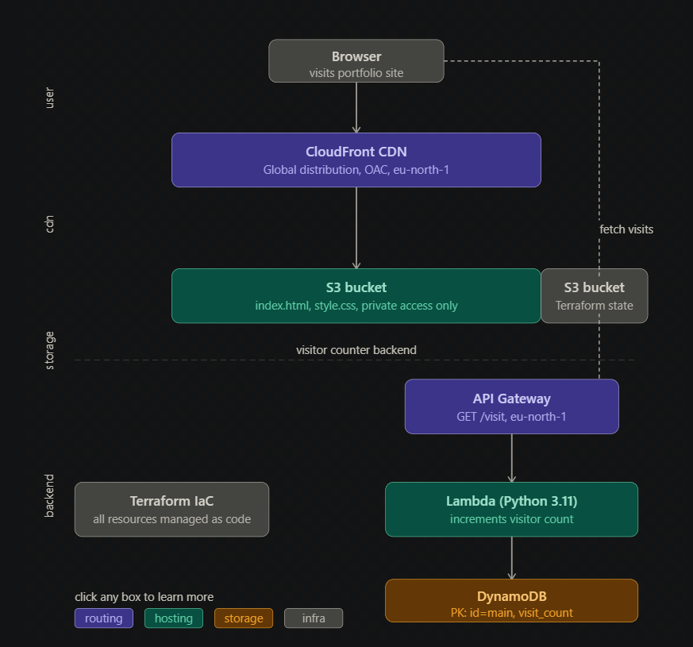

# Cloud Portfolio Website — AWS Serverless Hosting

A production-grade portfolio website hosted entirely on AWS using serverless architecture and Infrastructure as Code. Features global CDN delivery via CloudFront and a real-time visitor counter powered by Lambda and DynamoDB.

---

## Live Site

Live site: https://d200wx852sfwd7.cloudfront.net

API endpoint: https://9ocjb0c947.execute-api.eu-north-1.amazonaws.com/prod/visit

---

## What This Project Does

A static portfolio website hosted on S3 and delivered via CloudFront CDN. Every page visit triggers a serverless visitor counter that stores the count in DynamoDB and displays it live on the page.

```
User visits site
      |
      v
CloudFront CDN     <- serves HTML/CSS globally
      |
      v
S3 bucket          <- stores index.html, style.css (private)

Separately:
Page loads -> JS fetches visitor count
      |
      v
API Gateway -> Lambda -> DynamoDB (increments count)
      |
      v
Count displayed on page in real time
```

---

## Architecture

| Layer | Service | Purpose |
|---|---|---|
| CDN | CloudFront | Global delivery, HTTPS, caching |
| Storage | S3 | Static file hosting (private bucket) |
| Security | Origin Access Control (OAC) | Only CloudFront can read S3 |
| API | API Gateway | REST endpoint for visitor counter |
| Compute | Lambda (Python 3.11) | Increments visitor count atomically |
| Database | DynamoDB | Stores visitor count (PAY_PER_REQUEST) |
| IaC | Terraform | All infrastructure as code |
| State | S3 remote backend | Team-safe Terraform state |


---

## Key Design Decisions

**Private S3 bucket with OAC (not public)**
S3 bucket has no public access. Only CloudFront can read files via Origin Access Control. This is the modern AWS approach — the older Origin Access Identity (OAI) is deprecated.

> "I used OAC instead of OAI because OAI is deprecated and OAC supports more S3 features including SSE-KMS encryption."

**CloudFront for global delivery**
Without CloudFront, users far from eu-north-1 would experience high latency. CloudFront caches content at edge locations worldwide — users get the site from the nearest edge, not Stockholm.

**DynamoDB atomic increment**
The Lambda uses `ADD` in UpdateExpression — this is an atomic operation. Even if 1000 users visit simultaneously, every increment is counted correctly without race conditions.

**PAY_PER_REQUEST billing**
Portfolio sites have unpredictable, low traffic. PAY_PER_REQUEST means zero cost when no one visits. Provisioned capacity would waste money with reserved capacity sitting idle.

---

## Project Structure

```
static-website/
├── index.html              <- Portfolio page with visitor counter
├── style.css               <- Responsive CSS, mobile-friendly
├── lambda_function.py      <- Visitor counter Lambda handler
├── main.tf                 <- S3 + CloudFront + OAC
├── api_gateway.tf          <- REST API endpoint
├── lambda.tf               <- Lambda function + IAM role
├── dynamodb.tf             <- Visitor count table
└── .gitignore              <- Ignores state files and zips
```

---

## How the Visitor Counter Works

```python
# Lambda atomically increments count using DynamoDB ADD
response = table.update_item(
    Key={"id": "main"},
    UpdateExpression="ADD visit_count :inc",
    ExpressionAttributeValues={":inc": 1},
    ReturnValues="UPDATED_NEW"
)
```

The `ADD` operation in DynamoDB is atomic — it reads and increments in one operation, preventing race conditions even under high concurrency.

The frontend fetches this count on page load:

```javascript
const res = await fetch(API_URL);
const data = await res.json();
document.getElementById("visitCount").textContent = data.visits;
```

---

## Setup and Deployment

**Prerequisites:** AWS CLI configured, Terraform >= 1.0, Python 3.11

**1. Package Lambda:**
```bash
zip lambda.zip lambda_function.py
```

**2. Deploy infrastructure:**
```bash
terraform init
terraform plan
terraform apply
```

**3. Get your URLs:**
```bash
terraform output cloudfront_url
terraform output api_url
```

**4. Visit your site:**
```
https://{d200wx852sfwd7.cloudfront.net}
```

Wait ~5 minutes for CloudFront to propagate on first deploy.

---

## Outputs

After `terraform apply`:

```
cloudfront_url = "https://{d200wx852sfwd7.cloudfront.net}"
api_url        = "https://{9ocjb0c947.execute-api.eu-north-1.amazonaws.com/prod/visit}."
```

---

## Cleanup

```bash
terraform destroy
```

Removes all AWS resources — S3, CloudFront, Lambda, API Gateway, DynamoDB, IAM roles.

---

## Troubleshooting

**Visitor counter shows "Error":**
```bash
aws logs tail /aws/lambda/visitor-counter --follow
```
Check Lambda has DynamoDB permissions and table exists.

**CloudFront shows 403:**
Wait 5 minutes after deploy for cache propagation. Verify S3 bucket policy references the CloudFront OAC correctly.

**Terraform state lock:**
```bash
terraform force-unlock {lock-id}
```

---

## Technologies

| Component | Technology |
|---|---|
| Frontend | HTML5, CSS3 |
| Hosting | AWS S3 + CloudFront |
| Backend | AWS Lambda (Python 3.11) |
| API | AWS API Gateway (REST) |
| Database | AWS DynamoDB |
| IaC | Terraform |
| Region | eu-north-1 (Stockholm) |

---

## Author

**Anusha Maryam** — AWS Cloud Engineer
GitHub: [@anushamaryam2406-ops](https://github.com/anushamaryam2406-ops)
